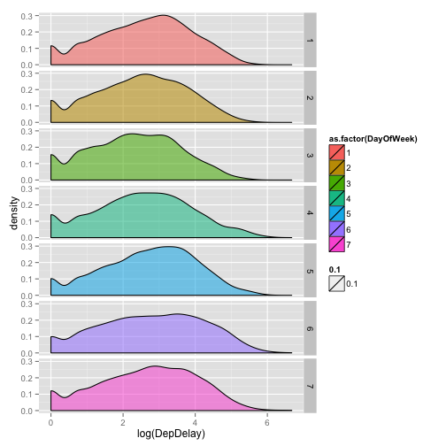
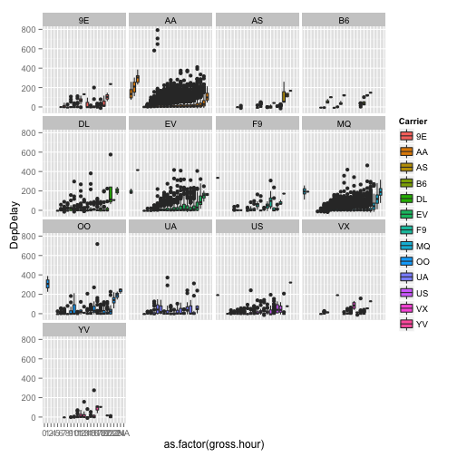

Final Project Outline  Junzhao Hu
========================================================
Topic Name: How to avoid incovenience in taking flight.

Below is the link for the data, I downloaded data for October, November and December of 2013.

I am interested in several things:

1 Is there a day of the week/ time of day effect on departure or arrival delays

2 Which city(Origin and Destination) cancels or delays the most.

3 Which Carrier delays or cancels most.

4 What kind of factors affect the delay time of the flight(like distance,depart time, arrive time)

5 Which company(UniqueCarrier) delays or cancels most.

6 Since we are in Ames, so we mainly take Des Moines International Airport as Origin or Destination, to find out
what kind of factors affect the delay and cancels of flight here.

Several interesting questions to be continued.

Using SQL to clean to clean the data...

**Links:**
* [http://www.transtats.bts.gov/DL_SelectFields.asp?Table_ID=236&DB_Short_Name=On-Time]

We used the following packages in this lab report:

```r
library(ggplot2)
library(XML)
library(RSQLite)
```

```
## Loading required package: DBI
```

```r
library(dplyr)
```

```
## 
## Attaching package: 'dplyr'
## 
## The following objects are masked from 'package:stats':
## 
##     filter, lag
## 
## The following objects are masked from 'package:base':
## 
##     intersect, setdiff, setequal, union
```

```r
library(xtable)
```


The package RSQLite can be used as in the example to create
a database as demonstrated in the lab slides:


```r
my_db <- dbConnect(dbDriver("SQLite"), dbname = "flights")
```

This creates a file called \verb!flights! in the current working directory.


In order to build the database we downloaded for On-Time Performance,
we downloaded the "Prezipped File" for November and December 2013 from


```r
url <- "http://www.transtats.bts.gov/DL_SelectFields.asp?Table_ID=236&DB_Short_Name=On-Time"
cat(url)
```

```
## http://www.transtats.bts.gov/DL_SelectFields.asp?Table_ID=236&DB_Short_Name=On-Time
```

```r
nov.d <- read.csv("/Users/Junzhaohu/Desktop/stat585/On_Time_On_Time_Performance_2013_11/11.csv")
```


The webpage we downloaded the data from also contains a 
description of the variables, which we may also want to add to the database for 
future reference.

```r
codebook <- readHTMLTable(url)[[7]][, 1:2]
names(codebook) <- c("Variable", "Description")
codebook <- codebook[!is.na(codebook$Description), ]
```

After examining the variable descriptions, we decided to 
choose the following variables from the set:

```r
choose.cols <- c("DayOfWeek", "FlightDate", "DepTime", "Carrier", "DepDelay", 
    "TaxiOut", "CarrierDelay", "WeatherDelay", "NASDelay", "SecurityDelay", 
    "LateAircraftDelay", "Cancelled", "Dest", "Origin", "Distance")
codebook.use <- codebook[which(codebook[, 1] %in% choose.cols), ]
codebook.table <- xtable(codebook.use, align = "p{1cm}p{3cm}p{7cm}", caption = "Description of Table Columns")
print(codebook.table, include.rownames = FALSE, caption.placement = "top")
```

```
## % latex table generated in R 3.0.2 by xtable 1.7-3 package
## % Wed Apr  9 09:23:18 2014
## \begin{table}[ht]
## \centering
## \caption{Description of Table Columns} 
## \begin{tabular}{p{3cm}p{7cm}}
##   \hline
## Variable & Description \\ 
##   \hline
## DayOfWeek & Day of Week \\ 
##   FlightDate & Flight Date (yyyymmdd) \\ 
##   Carrier & Code assigned by IATA and commonly used to identify a carrier. As the same code may have been assigned to different carriers over time, the code is not always unique. For analysis, use the Unique Carrier Code. \\ 
##   Origin & Origin Airport \\ 
##   Dest & Destination Airport \\ 
##   DepTime & Actual Departure Time (local time: hhmm) \\ 
##   DepDelay & Difference in minutes between scheduled and actual departure time. Early departures show negative numbers. \\ 
##   TaxiOut & Taxi Out Time, in Minutes \\ 
##   Cancelled & Cancelled Flight Indicator (1=Yes) \\ 
##   Distance & Distance between airports (miles) \\ 
##   CarrierDelay & Carrier Delay, in Minutes \\ 
##   WeatherDelay & Weather Delay, in Minutes \\ 
##   NASDelay & National Air System Delay, in Minutes \\ 
##   SecurityDelay & Security Delay, in Minutes \\ 
##   LateAircraftDelay & Late Aircraft Delay, in Minutes \\ 
##    \hline
## \end{tabular}
## \end{table}
```

We can add this file to our database using hte following:

```r
nov.db <- dbWriteTable(my_db, "myFlights", nov.d[, choose.cols], overwrite = TRUE)
dbListTables(my_db)
```

```
## [1] "myFlights"
```


```r
dec.d <- read.csv("/Users/Junzhaohu/Desktop/stat585/On_Time_On_Time_Performance_2013_12/12.csv")
dim.dec <- dim(dec.d)
novdec.db <- dbWriteTable(my_db, "myFlights", dec.d[, choose.cols], append = TRUE)
dbDisconnect(my_db)
```

```
## [1] TRUE
```


With the data in the flights database, we can now use dplyr to 
begin an analysis.

Connecting to the database using:


```r
my_db <- src_sqlite("flights")
```

```
## Loading required package: RSQLite.extfuns
```

We can get the number of rows using 

```r
tbl(my_db, sql("SELECT COUNT(*) FROM myFlights"))
```

```
## Source: sqlite 3.7.17 [flights]
## From: <derived table> [?? x 1]
## 
##    COUNT(*)
## 1   1020035
## ..      ...
```


We decided to use Des Moines Internatioal Airport (DSM). 

```r
# qry will now work as a connector to the table 'myFlights' in my_db
qry <- tbl(my_db, "myFlights")

# We only want to connect to when Origin is 'DSM'
qry <- filter(qry, Origin == "DSM")

# Lets get all those observations
dfw1 = collect(qry)

# and make an ugly plot
qplot(log(DepDelay), geom = "density", alpha = 0.1, facets = DayOfWeek ~ ., 
    fill = as.factor(DayOfWeek), data = dfw1[which(dfw1$DepDelay > 0), ])
```

 

```r

dfw1$gross.time <- round(dfw1$DepTime/100) * 60 + 100 * ((dfw1$DepTime/100) - 
    round(dfw1$DepTime/100))
dfw1$gross.hour <- round(dfw1$gross.time/60)

qplot(as.factor(gross.hour), DepDelay, fill = Carrier, data = dfw1, geom = "boxplot") + 
    facet_wrap(~Carrier)
```

```
## Warning: Removed 6 rows containing non-finite values (stat_boxplot).
## Warning: Removed 8 rows containing non-finite values (stat_boxplot).
## Warning: Removed 16 rows containing non-finite values (stat_boxplot).
## Warning: Removed 36 rows containing non-finite values (stat_boxplot).
## Warning: Removed 3 rows containing non-finite values (stat_boxplot).
## Warning: Removed 3 rows containing non-finite values (stat_boxplot).
```

 

Notice from the boxplots that the time of delay grows for 
most airlines over the course
of the day. This may be due to a domino effect as one late 
plane causes backups at terminals
and on the runway leading to more delays for the airline.
This causes the early morning flights to generally have a delay of more than one hour.
The carriers most effected by this seem to be MQ (whose delays grow quickly at the end of the day),
AA (which has the worst late flight delays and seems to be most effected at night)
and OO which has no on time flights after 10:00 PM).

Some airlines seem to be worse during the day in general. For instance UA has 
several midday flights where the number of delayed departures grows (the boxplots 
become visible by 8:00 AM) 


 -->
