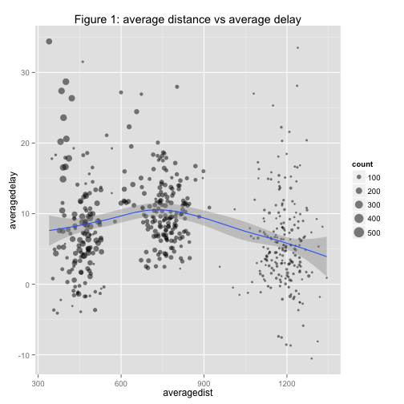
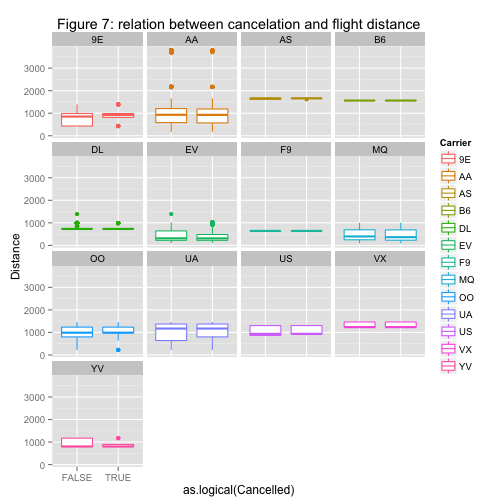
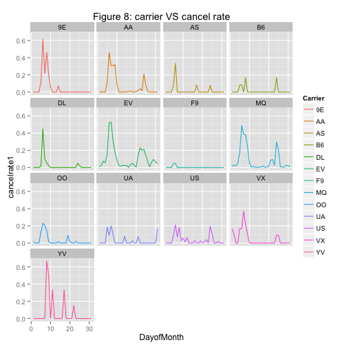

Final Project  Junzhao Hu
========================================================
Topic Name: About the flight data of Dallas/Fort Worth Airport (DFW).

Below is the link for the data, I downloaded data for  November and December of 2013.

I am interested in several things:

1 Is there a day of the week/ time of day effect on departure or arrival delays

2 Which airports cancel or delay the most from Dallas/Fort Worth Airport (DFW).

3 Which Carrier delays or cancels most.

4 What kind of factors affect the delay time of the flight(like distance,depart time, arrive time)

5 What's the main reason for the delay and cancelation.


**Links:**
* [http://www.transtats.bts.gov/DL_SelectFields.asp?Table_ID=236&DB_Short_Name=On-Time]

We used the following packages in this lab report:

```r
library(ggplot2)
library(XML)
library(DBI)
library(RSQLite)

library(plyr)
library(xtable)
library(dplyr)
```

```
## 
## Attaching package: 'dplyr'
## 
## The following objects are masked from 'package:plyr':
## 
##     arrange, desc, failwith, id, mutate, summarise
## 
## The following objects are masked from 'package:stats':
## 
##     filter, lag
## 
## The following objects are masked from 'package:base':
## 
##     intersect, setdiff, setequal, union
```


The package RSQLite can be used as in the example to create
a database as demonstrated in the lab slides:


```r
my_db <- dbConnect(dbDriver("SQLite"), dbname = "flights")
```

This creates a file called flights in the current working directory.


In order to build the database we downloaded for On-Time Performance,
we downloaded the zipped File for November and December 2013 from


```r
url <- "http://www.transtats.bts.gov/DL_SelectFields.asp?Table_ID=236&DB_Short_Name=On-Time"
cat(url)
```

```
## http://www.transtats.bts.gov/DL_SelectFields.asp?Table_ID=236&DB_Short_Name=On-Time
```

```r
nov.d <- read.csv("/Users/Junzhaohu/Desktop/stat585/On_Time_On_Time_Performance_2013_11/11.csv")
```


The webpage we downloaded the data from also contains a 
description of the variables, which we may also want to add to the database for 
future reference.

```r
codebook <- readHTMLTable(url)[[7]][, 1:2]
names(codebook) <- c("Variable", "Description")
codebook <- codebook[!is.na(codebook$Description), ]
```

After examining the variable descriptions, we decided to 
choose the following variables from the set:

```r
choose.cols <- c("DayOfWeek", "DayofMonth", "TailNum", "FlightDate", "DepTime", 
    "Carrier", "DepDelay", "ArrDelay", "CarrierDelay", "WeatherDelay", "LateAircraftDelay", 
    "Cancelled", "Dest", "Origin", "Distance")
codebook.use <- codebook[which(codebook[, 1] %in% choose.cols), ]
codebook.table <- xtable(codebook.use, align = "p{1cm}p{3cm}p{7cm}", caption = "Description of Table Columns")
print(codebook.table, include.rownames = FALSE, caption.placement = "top")
```

```
## % latex table generated in R 3.0.2 by xtable 1.7-3 package
## % Wed Apr 23 10:52:45 2014
## \begin{table}[ht]
## \centering
## \caption{Description of Table Columns} 
## \begin{tabular}{p{3cm}p{7cm}}
##   \hline
## Variable & Description \\ 
##   \hline
## DayofMonth & Day of Month \\ 
##   DayOfWeek & Day of Week \\ 
##   FlightDate & Flight Date (yyyymmdd) \\ 
##   Carrier & Code assigned by IATA and commonly used to identify a carrier. As the same code may have been assigned to different carriers over time, the code is not always unique. For analysis, use the Unique Carrier Code. \\ 
##   TailNum & Tail Number \\ 
##   Origin & Origin Airport \\ 
##   Dest & Destination Airport \\ 
##   DepTime & Actual Departure Time (local time: hhmm) \\ 
##   DepDelay & Difference in minutes between scheduled and actual departure time. Early departures show negative numbers. \\ 
##   ArrDelay & Difference in minutes between scheduled and actual arrival time. Early arrivals show negative numbers. \\ 
##   Cancelled & Cancelled Flight Indicator (1=Yes) \\ 
##   Distance & Distance between airports (miles) \\ 
##   CarrierDelay & Carrier Delay, in Minutes \\ 
##   WeatherDelay & Weather Delay, in Minutes \\ 
##   LateAircraftDelay & Late Aircraft Delay, in Minutes \\ 
##    \hline
## \end{tabular}
## \end{table}
```

```r
# print(codebook.table,type='html')
```

We can add this file to our database using the following:

```r
nov.db <- dbWriteTable(my_db, "myFlights", nov.d[, choose.cols], overwrite = TRUE)
dbListTables(my_db)
```

```
## [1] "myFlights"
```


```r
dec.d <- read.csv("/Users/Junzhaohu/Desktop/stat585/On_Time_On_Time_Performance_2013_12/12.csv")
dim.dec <- dim(dec.d)
novdec.db <- dbWriteTable(my_db, "myFlights", dec.d[, choose.cols], append = TRUE)
dbDisconnect(my_db)
```

```
## [1] TRUE
```


With the data in the flights database, we can now use dplyr to 
begin an analysis.

Connecting to the database using:


```r
library("RSQLite.extfuns")
my_db <- src_sqlite("flights")
```

We can get the number of rows using 

```r
tbl(my_db, sql("SELECT COUNT(*) FROM myFlights"))
```

```
## Source: sqlite 3.7.17 [flights]
## From: <derived table> [?? x 1]
## 
##    COUNT(*)
## 1   1020035
## ..      ...
```

We use Dallas/Fort Worth Airport (DFW) as orgin. 

```r
# qry will now work as a connector to the table 'myFlights' in my_db
qry <- tbl(my_db, "myFlights")

# We only want to connect to when Origin is 'DFW'
qry1 <- filter(qry, Origin == "DFW")

# Lets get all those observations
dfw1 = collect(qry1)

planes <- group_by(dfw1, TailNum)
delay <- dplyr::summarise(planes, count = n(), dist = mean(Distance, na.rm = TRUE), 
    delay = mean(ArrDelay, na.rm = TRUE))
delay <- filter(delay, count > 20, dist < 2000)

ggplot(delay, aes(dist, delay)) + geom_point(aes(size = count), alpha = 1/2) + 
    geom_smooth() + scale_size_area()
```

```
## geom_smooth: method="auto" and size of largest group is <1000, so using loess. Use 'method = x' to change the smoothing method.
```

```
## Warning: Removed 1 rows containing missing values (stat_smooth).
## Warning: Removed 1 rows containing missing values (geom_point).
```

 

Most filghts are middle distance or short distance flights.

The average delay rate of middle average distance(600-900) flights is more than that of short and long average distance.


```r
destinations <- group_by(dfw1, Dest)
destairp <- dplyr::summarise(destinations, planes = n_distinct(TailNum), flights = n())
arrange(destairp, desc(flights))
```

```
## Source: local data frame [143 x 3]
## 
##    Dest planes flights
## 1   LAX    465    1348
## 2   ATL    350    1201
## 3   ORD    344    1140
## 4   DEN    507    1087
## 5   SFO    435    1017
## 6   IAH    447     900
## 7   PHX    360     868
## 8   SAT    164     862
## 9   CLT    234     807
## 10  AUS    240     802
## ..  ...    ...     ...
```

```r

qry2 <- filter(qry, Dest == "DFW")
dfw2 = collect(qry2)
origins <- group_by(dfw2, Origin)
oriairp <- dplyr::summarise(origins, planes1 = n_distinct(TailNum), flights1 = n(), 
    mprop.flights1.can = mean(Cancelled, na.rm = T))
arrange(oriairp, desc(flights1))
```

```
## Source: local data frame [143 x 4]
## 
##    Origin planes1 flights1 mprop.flights1.can
## 1     LAX     464     1348            0.04674
## 2     ATL     347     1201            0.04829
## 3     DEN     529     1126            0.03996
## 4     ORD     320     1103            0.05077
## 5     SFO     452     1013            0.04146
## 6     PHX     353      868            0.04839
## 7     SAT     164      862            0.07077
## 8     IAH     387      843            0.04982
## 9     CLT     234      807            0.05328
## 10    AUS     238      803            0.06351
## ..    ...     ...      ...                ...
```

```r
daf <- arrange(oriairp, desc(mprop.flights1.can))
daf <- filter(daf, flights1 > 500)
qplot(as.factor(Origin), mprop.flights1.can, data = daf)
```

 

From the reslut, the first five most frequenly connected airports with DFW are LAX,ATL,DEN,ORD and SFO.
For total flights more than 500, flights go to HOU airport have the highest cancelation rate from DFW airport.

```r
qry <- tbl(my_db, "myFlights")
qry1 <- filter(qry, Origin == "DFW")
# Lets get all those observations
dfw1 = collect(qry1)
# and make an ugly plot
qplot(log(DepDelay), geom = "density", alpha = 0.1, facets = DayOfWeek ~ ., 
    fill = as.factor(DayOfWeek), data = dfw1[which(dfw1$DepDelay > 0), ])
```

 

```r
dfw1$gross.time <- round(dfw1$DepTime/100) * 60 + 100 * ((dfw1$DepTime/100) - 
    round(dfw1$DepTime/100))
dfw1$gross.hour <- round(dfw1$gross.time/60)

qplot(as.factor(gross.hour), DepDelay, fill = Carrier, data = dfw1, geom = "boxplot") + 
    facet_wrap(~Carrier)
```

```
## Warning: Removed 19 rows containing non-finite values (stat_boxplot).
## Warning: Removed 1667 rows containing non-finite values (stat_boxplot).
## Warning: Removed 4 rows containing non-finite values (stat_boxplot).
## Warning: Removed 3 rows containing non-finite values (stat_boxplot).
## Warning: Removed 20 rows containing non-finite values (stat_boxplot).
## Warning: Removed 309 rows containing non-finite values (stat_boxplot).
## Warning: Removed 1 rows containing non-finite values (stat_boxplot).
## Warning: Removed 1146 rows containing non-finite values (stat_boxplot).
## Warning: Removed 26 rows containing non-finite values (stat_boxplot).
## Warning: Removed 14 rows containing non-finite values (stat_boxplot).
## Warning: Removed 41 rows containing non-finite values (stat_boxplot).
## Warning: Removed 16 rows containing non-finite values (stat_boxplot).
## Warning: Removed 5 rows containing non-finite values (stat_boxplot).
```

 

Notice from the boxplots that the time of delay grows for 
most airlines over the course
of the day. This may be due to a domino effect as one late 
plane causes backups at terminals
and on the runway leading to more delays for the airline.
This causes the early morning flights to generally have a delay of more than one hour.
The carriers most affected by this seem to be MQ (whose delays grow quickly at the end of the day),
AA (which has the worst late flight delays and seems to be most effected at night)
and OO which has no on time flights after 10:00 PM).

Some airlines seem to be worse during the day in general. For instance UA has 
several midday flights where the number of delayed departures grows (the boxplots 
become visible by 8:00 AM) 

```r
qry1 <- filter(qry, Origin == "DFW")
dfw1 = collect(qry1)
qry2 <- filter(qry, Dest == "DFW")
dfw2 = collect(qry2)
dfw3 <- rbind(dfw1, dfw2)

can.d <- ddply(dfw3, .(Carrier, DayOfWeek), summarise, total.flights.can = sum(Cancelled, 
    na.rm = T), prop.flights.can = mean(Cancelled, na.rm = T))
qplot(DayOfWeek, prop.flights.can, color = Carrier, data = can.d, geom = "line") + 
    facet_wrap(~Carrier)
```

 

```r

qplot(as.logical(Cancelled), Distance, color = Carrier, data = dfw3, geom = "boxplot") + 
    facet_wrap(~Carrier)
```

 

Flights that occur later in the week and on the weekend are more often cancelled,
with airlines EV, MQ and 9E cancelling more than 15% of flights. 9E is more likely to cancel 
long flights while EV is more likely to cancel shorter flights. The rest of the 
airlines seem to have no relationship between flight length and cancellation.

What's the reason for so many cancelations? Is there a day that has very bad weather?

```r
can.dm <- ddply(dfw3, .(Carrier, DayofMonth), summarise, mtotal.flights.can1 = sum(Cancelled, 
    na.rm = T), mprop.flights.can1 = mean(Cancelled, na.rm = T))
qplot(DayofMonth, mprop.flights.can1, color = Carrier, data = can.dm, geom = "line") + 
    facet_wrap(~Carrier)
```

 

From the graph, we see that on November 7th or Decmeber 7th, there is one day that greatly influenced the cancelation.

After checking the news, It's said that there is a big ice storm on December 6th, and continued on December 7th, and this leads to delay of thousands of flights and nearly a thousand flights canceled.
 -->
